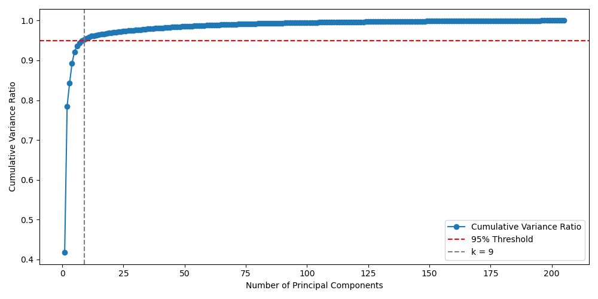
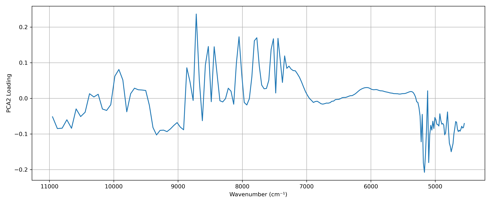
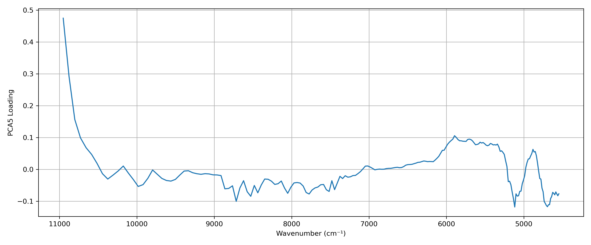
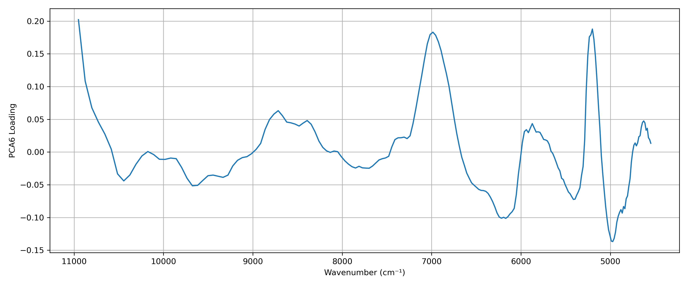
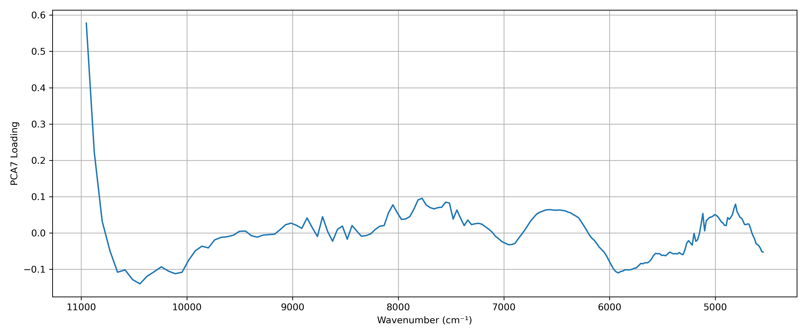
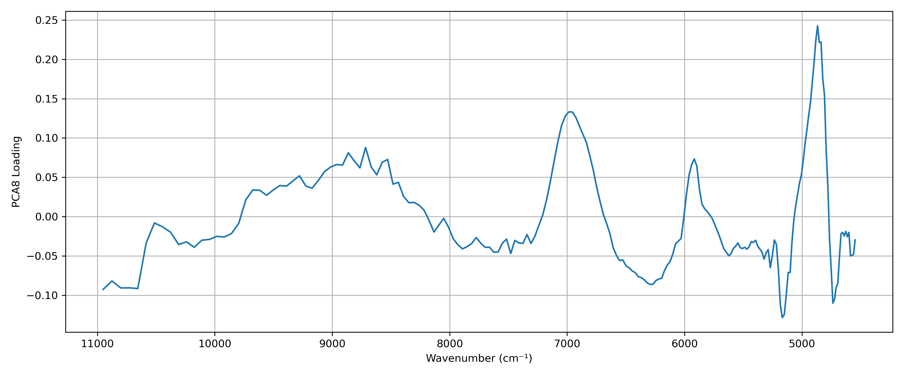
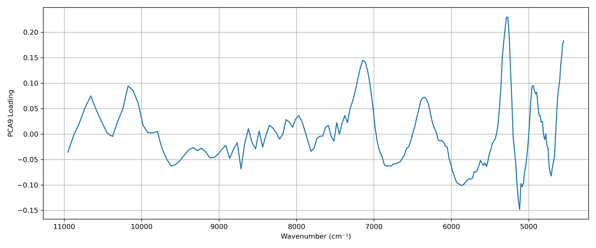

# 背景

# 研究目的

# 実験方法

# データ前処理

### 強度から反射率へ変換
1. 2200 nm 以上をカット
2. 強度から反射率への変換

$$
R = \frac{(I_{3.0} - D_{3.0}) / 3}{(W_{2.5} - D_{2.5}) / 2.5}
$$

### マスク画像の作成

1. ハイパースペクトル画像のPC1に対して大津の二値化

2. 大津の二値化画像により得られたマスク画像に対してモルフォロジー演算

3. 得られたマスク画像に内接する最大の長方形をマスク画像とする<br>
   ふちにノイズが多く、また平面部分ではなく側面のデータも含む場合があるため。<br>
   特にPCAにおいてこの操作を行わないと、分散の最大方向がノイズになる。<br>

<table>
  <tr>
    <th>操作 1</th>
    <th>操作 2</th>
    <th>操作 3</th>
  </tr>
  <tr>
    <td></td>
    <td></td>
    <td></td>
  </tr>
</table>

### SNV処理

* **目的**：散乱やベースラインのばらつきを抑え、スペクトル間の比較をしやすくする。
* **処理内容**：各サンプル単位で**Z-score標準化**を行う（平均0、分散1にする）。


あるサンプルのスペクトルをベクトル

$$
\mathbf{x} = [x_1, x_2, \dots, x_L]^\top
$$

とすると、SNV処理後のスペクトル $\mathbf{x}^{\text{SNV}}$ は以下で定義されます：

$$
x_i^{\text{SNV}} = \frac{x_i - \mu}{\sigma} \quad \text{for } i = 1, 2, \dots, L
$$

ここで：

* $\mu = \frac{1}{L} \sum_{i=1}^L x_i$：スペクトルの平均
* $\sigma = \sqrt{\frac{1}{L - 1} \sum_{i=1}^L (x_i - \mu)^2}$：不偏標準偏差（分母は $L - 1$）

<br>

# 解析

> 近赤外ハイパースペクトル画像を用いて、木材の劣化領域を非破壊かつ教師なしで検出する手法を考える。<br>
また、得られたクラスタの平均スペクトルに対してピーク分離処理（SG法による二次微分）を行い、化学的変化やパターンを解釈する。

## 1. 主成分分析 (PCA)

累積寄与率 95 % を達成する最小の $k$ を選択した。<br>



### 主成分とローディングプロットの可視化

#### 主成分（標準化済み）

<table>
  <tr>
    <th>PC1</th>
    <th>PC2</th>
    <th>PC3</th>
  </tr>
  <tr>
    <td></td>
    <td></td>
    <td></td>
  </tr>
  <tr>
    <th>PC4</th>
    <th>PC5</th>
    <th>PC6</th>
  </tr>
  <tr>
    <td></td>
    <td></td>
    <td></td>
  </tr>
  <tr>
    <th>PC7</th>
    <th>PC8</th>
    <th>PC9</th>
  </tr>
  <tr>
    <td></td>
    <td></td>
    <td></td>
  </tr>
</table>

#### ローディングプロット

<table>
  <tr>
    <th>PC1 Loading</th>
    <th>PC2 Loading</th>
    <th>PC3 Loading</th>
  </tr>
  <tr>
    <td></td>
    <td></td>
    <td></td>
  </tr>
  <tr>
    <th>PC4 Loading</th>
    <th>PC5 Loading</th>
    <th>PC6 Loading</th>
  </tr>
  <tr>
    <td></td>
    <td></td>
    <td></td>
  </tr>
  <tr>
    <th>PC7 Loading</th>
    <th>PC8 Loading</th>
    <th>PC9 Loading</th>
  </tr>
  <tr>
    <td></td>
    <td></td>
    <td></td>
  </tr>
</table>

### KMeans によるクラスタリング

PCA により得られた 9 つの主成分に対して標準化し、**KMeans** を用いてクラスタリングする。 

最適なクラスタ数 $k$ は**エルボー法**により決定した。<br>


### クラスタの分布


### 各クラスタのスペクトル

二次微分に関しては `Reflectance` をSG法を用いて以下の設定で実行した。

```python
from scipy.signal import savgol_filter

# パラメータ設定
window_length = 7
polyorder = 2
deriv_order = 2
```

<table>
  <tr>
    <th>Reflectance</th>
    <th>Reflectance (SNV)</th>
    <th>2nd Deriv (SG)</th>
  </tr>
  <tr>
    <td></td>
    <td></td>
    <td></td>
  </tr>
</table>

## 2. AutoEncoder (Transformer-base)
PCA と同じく 9 次元に削減した。
### Latant Spaces
各次元において標準化済み
<table>
  <tr>
    <th>Latent 1</th>
    <th>Latent 2</th>
    <th>Latent 3</th>
  </tr>
  <tr>
    <td></td>
    <td></td>
    <td></td>
  </tr>
  <tr>
    <th>Latent 4</th>
    <th>Latent 5</th>
    <th>Latent 6</th>
  </tr>
  <tr>
    <td></td>
    <td></td>
    <td></td>
  </tr>
  <tr>
    <th>Latent 7</th>
    <th>Latent 8</th>
    <th>Latent 9</th>
  </tr>
  <tr>
    <td></td>
    <td></td>
    <td></td>
  </tr>
</table>

### KMeans
クラスタ数 1 ~ 50 で探索


### 各クラスタのスペクトル

<table>
  <tr>
    <th>Reflectance</th>
    <th>Reflectance (SNV)</th>
    <th>2nd Deriv (SG)</th>
  </tr>
  <tr>
    <td></td>
    <td></td>
    <td></td>
  </tr>
</table>

## 3. Denoising Augmentation Transformer AutoEncoder

### Aug の設計
```python
def augment(
    x,
    noise_range=(-0.05, 0.05),
    shift_range=(-0.2, 0.2),
    slope_range=(-0.2, 0.2),
    cutout_ratio=0.05,
    stretch_scale=1.2,
    local_shift_range=(-2, 2),
    n_apply=3
):
    B, L = x.shape
    device = x.device

    def aug_noise(x):
        scale = torch.empty(x.size(0), 1, device=x.device).uniform_(*noise_range)
        return x + torch.randn_like(x) * scale

    def aug_shift(x):
        shift = torch.empty(x.size(0), 1, device=x.device).uniform_(*shift_range)
        return x + shift

    def aug_slope(x):
        ramp = torch.linspace(-0.5, 0.5, steps=L, device=x.device).unsqueeze(0)
        ramp = ramp.expand(x.size(0), -1)
        slope = torch.empty(x.size(0), 1, device=x.device).uniform_(*slope_range)
        return x + slope * ramp

    def aug_cutout(x):
        cut_len = max(1, int(L * cutout_ratio))
        start_idxs = torch.randint(0, L - cut_len + 1, (x.size(0),), device=x.device)
        mask = torch.ones_like(x, dtype=torch.bool)
        idx_range = torch.arange(cut_len, device=x.device).unsqueeze(0)
        cut_idxs = (start_idxs.unsqueeze(1) + idx_range).clamp(0, L - 1)
        mask.scatter_(1, cut_idxs, False)
        return x.masked_fill(~mask, 0.0)

    def aug_stretch(x):
        x_ = x.unsqueeze(1)  # [B,1,L]
        new_len = int(L * stretch_scale)
        stretched = F.interpolate(x_, size=new_len, mode='linear', align_corners=False)
        return F.interpolate(stretched, size=L, mode='linear', align_corners=False).squeeze(1)

    def aug_local_shift(x):
        B_sub, L_sub = x.shape
        x_aug = torch.zeros_like(x)
        for i in range(B_sub):
            shift = int(torch.randint(local_shift_range[0], local_shift_range[1]+1, (1,)).item())
            if shift > 0:
                x_aug[i, shift:] = x[i, :-shift]
                x_aug[i, :shift] = x[i, 0]
            elif shift < 0:
                x_aug[i, :shift] = x[i, -shift:]
                x_aug[i, shift:] = x[i, -1]
            else:
                x_aug[i] = x[i]
        return x_aug

    aug_funcs = [aug_noise, aug_shift, aug_slope, aug_cutout, aug_stretch, aug_local_shift]
    n_aug = len(aug_funcs)

    selected_aug_ids = torch.stack([
        torch.randperm(n_aug, device=device)[:n_apply] for _ in range(B)
    ])  # [B, n_apply]

    x_aug = x.clone()

    for step in range(n_apply):
        step_ids = selected_aug_ids[:, step]
        for aug_id in range(n_aug):
            mask = (step_ids == aug_id)
            if mask.any():
                x_aug[mask] = aug_funcs[aug_id](x_aug[mask])

    return x_aug
```

### Latent Spaces

<table>
  <tr>
    <th>Latent 1</th>
    <th>Latent 2</th>
    <th>Latent 3</th>
  </tr>
  <tr>
    <td></td>
    <td></td>
    <td></td>
  </tr>
  <tr>
    <th>Latent 4</th>
    <th>Latent 5</th>
    <th>Latent 6</th>
  </tr>
  <tr>
    <td></td>
    <td></td>
    <td></td>
  </tr>
  <tr>
    <th>Latent 7</th>
    <th>Latent 8</th>
    <th>Latent 9</th>
  </tr>
  <tr>
    <td></td>
    <td></td>
    <td></td>
  </tr>
</table>

### KMeans
クラスタ数 1 ~ 50 で探索


### 各クラスタのスペクトル

<table>
  <tr>
    <th>Reflectance</th>
    <th>Reflectance (SNV)</th>
    <th>2nd Deriv (SG)</th>
  </tr>
  <tr>
    <td></td>
    <td></td>
    <td></td>
  </tr>
</table>

## クラスタの評価（シルエットスコア）
## 考察

## 結果

今回の分析では、PCAでもある程度有効なクラスタリングが可能であったが、これは**劣化のパターン自体が少なく、かつ明瞭であった**という点も大きく影響している。すなわち、**分類すべき劣化状態が限定的かつスペクトル的に顕著である場合には、PCAのような線形手法でも本質的な軸を抽出できる可能性がある**。

しかし、これはあくまで「限定された実験条件下」での結果であり、現実世界のデータでは、劣化のパターンはより多様で複雑になることが予想される。例えば、**経時劣化・環境劣化・微細な構造変化・材料の個体差**など、複数の要因が重層的に絡み合う中でスペクトル変化が生じるケースでは、PCAのような単純な分散ベースの手法では、それらをうまく分離・識別することが困難になる。

対して、深層学習は、**非線形な特徴空間における微細なパターンの違い**を捉える能力に優れており、劣化の種類が増えたり、変化が微弱になっても性能を維持しやすい。さらに、（特に方法 `3`）ノイズに対する頑健性も高く、**実運用レベルの品質管理や予兆検知といったタスクにも展開しやすい**という利点がある。

したがって、今回の結果は「PCAでも使える場面はある」と同時に、**「今後タスクが複雑化するほど深層モデルの必要性が高まる」ことを示唆している**。特に、本研究の最終的な目標である**実環境下での非破壊・高精度な劣化診断の確立**においては、深層学習的アプローチの採用が不可欠になると考えられる。

