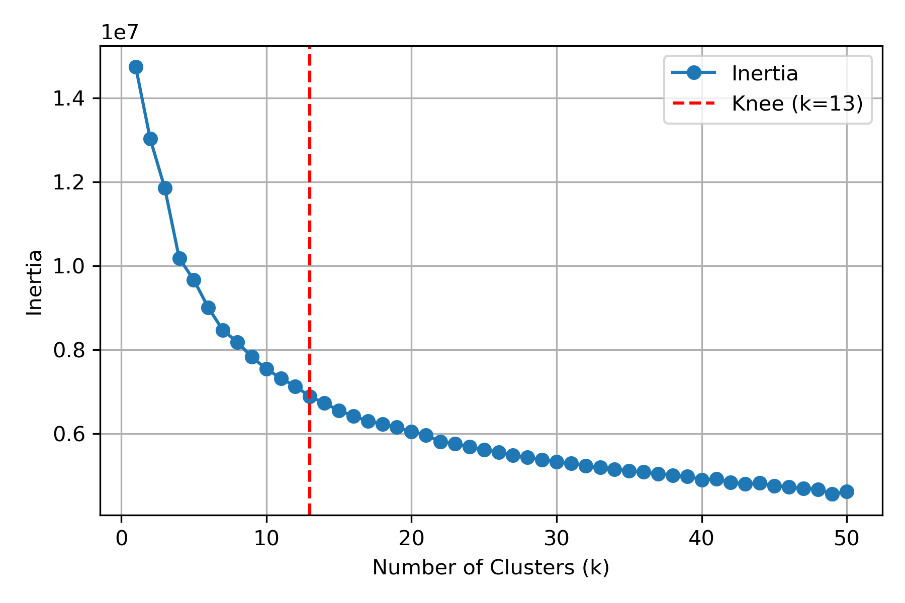
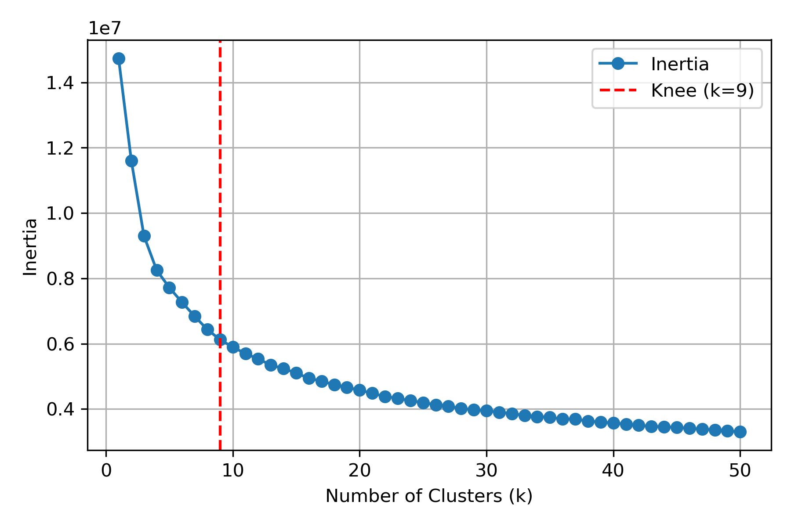

# 背景

# 研究目的

# 実験方法

# データ前処理

### 強度から反射率へ変換
1. 2200 nm 以上をカット
2. 強度から反射率への変換
$$
R = \frac{(I_{3.0} - D_{3.0}) / 3}{(W_{2.5} - D_{2.5}) / 2.5}
$$

### マスク画像の作成

1. ハイパースペクトル画像のPC1に対して大津の二値化

2. 大津の二値化画像により得られたマスク画像に対してモフォロジー演算

3. 得られたマスク画像に内接する最大の長方形をマスク画像とする<br>
   ふちにノイズが多く、また平面部分ではなく側面のデータも含む場合があるため。<br>
   特にPCAにおいてこの操作を行わないと、分散の最大方向がノイズになる。<br>

<table>
  <tr>
    <th>操作 1</th>
    <th>操作 2</th>
    <th>操作 3</th>
  </tr>
  <tr>
    <td></td>
    <td></td>
    <td></td>
  </tr>
</table>

### SNV処理

* **目的**：散乱やベースラインのばらつきを抑え、スペクトル間の比較をしやすくする。
* **処理内容**：各サンプル単位で**Z-score標準化**を行う（平均0、分散1にする）。


あるサンプルのスペクトルをベクトル

$$
\mathbf{x} = [x_1, x_2, \dots, x_L]^\top
$$

とすると、SNV処理後のスペクトル $\mathbf{x}^{\text{SNV}}$ は以下で定義されます：

$$
x_i^{\text{SNV}} = \frac{x_i - \mu}{\sigma} \quad \text{for } i = 1, 2, \dots, L
$$

ここで：

* $\mu = \frac{1}{L} \sum_{i=1}^L x_i$：スペクトルの平均
* $\sigma = \sqrt{\frac{1}{L - 1} \sum_{i=1}^L (x_i - \mu)^2}$：不偏標準偏差（分母は $L - 1$）

<br>

# 解析

> 近赤外ハイパースペクトル画像を用いて、木材の劣化領域を非破壊かつ教師なしで検出する手法を考える。<br>
また、得られたクラスタの平均スペクトルに対してピーク分離処理（SG法による二次微分）を行い、化学的変化やパターンを解釈する。

## 1. 主成分分析 (PCA)

累積寄与率 95 % を達成する最小の $k$ を選択した。<br>


### 主成分とローディングプロットの可視化

#### 主成分（標準化済み）

<table>
  <tr>
    <th>PC1</th>
    <th>PC2</th>
    <th>PC3</th>
  </tr>
  <tr>
    <td></td>
    <td></td>
    <td></td>
  </tr>
  <tr>
    <th>PC4</th>
    <th>PC5</th>
    <th>PC6</th>
  </tr>
  <tr>
    <td></td>
    <td></td>
    <td></td>
  </tr>
  <tr>
    <th>PC7</th>
    <th>PC8</th>
    <th>PC9</th>
  </tr>
  <tr>
    <td></td>
    <td></td>
    <td></td>
  </tr>
</table>

#### ローディングプロット

<table>
  <tr>
    <th>PC1 Loading</th>
    <th>PC2 Loading</th>
    <th>PC3 Loading</th>
  </tr>
  <tr>
    <td></td>
    <td></td>
    <td></td>
  </tr>
  <tr>
    <th>PC4 Loading</th>
    <th>PC5 Loading</th>
    <th>PC6 Loading</th>
  </tr>
  <tr>
    <td></td>
    <td></td>
    <td></td>
  </tr>
  <tr>
    <th>PC7 Loading</th>
    <th>PC8 Loading</th>
    <th>PC9 Loading</th>
  </tr>
  <tr>
    <td></td>
    <td></td>
    <td></td>
  </tr>
</table>

### KMeans によるクラスタリング

PCA により得られた 9 つの主成分に対して標準化し、**KMeans** を用いてクラスタリングする。 

最適なクラスタ数 $k$ は**エルボー法**により決定した。<br>



### クラスタの分布


### 各クラスタのスペクトル

二次微分に関しては `Reflectance` をSG法を用いて以下の設定で実行した。

```python
from scipy.signal import savgol_filter

# パラメータ設定
window_length = 7
polyorder = 2
deriv_order = 2
```

<table>
  <tr>
    <th>Reflectance</th>
    <th>Reflectance (SNV)</th>
    <th>2nd Deriv (SG)</th>
  </tr>
  <tr>
    <td></td>
    <td></td>
    <td></td>
  </tr>
</table>

## 2. AutoEncoder (Transformer-base)
PCA と同じく 9 次元に削減した。
### Latant Spaces
各次元において標準化済み
<table>
  <tr>
    <th>Latent 1</th>
    <th>Latent 2</th>
    <th>Latent 3</th>
  </tr>
  <tr>
    <td></td>
    <td></td>
    <td></td>
  </tr>
  <tr>
    <th>Latent 4</th>
    <th>Latent 5</th>
    <th>Latent 6</th>
  </tr>
  <tr>
    <td></td>
    <td></td>
    <td></td>
  </tr>
  <tr>
    <th>Latent 7</th>
    <th>Latent 8</th>
    <th>Latent 9</th>
  </tr>
  <tr>
    <td></td>
    <td></td>
    <td></td>
  </tr>
</table>

### KMeans
クラスタ数 1 ~ 50 で探索



最適なクラスタ数 : $k = 11$


### 各クラスタのスペクトル

<table>
  <tr>
    <th>Reflectance</th>
    <th>Reflectance (SNV)</th>
    <th>2nd Deriv (SG)</th>
  </tr>
  <tr>
    <td></td>
    <td></td>
    <td></td>
  </tr>
</table>

## 3. SimCLR
潜在空間は 9 次元だが、そこから 16 次元に投影して損失を計算している。
### Aug の設計
```python
def augment(
    x,
    noise_range=(-0.1, 0.1),
    scale_range=(0.9, 1.1),
    shift_range=(-0.1, 0.1),
    slope_range=(-0.1, 0.1),
    mixup_alpha=0.4,
    p_noise=0.3,
    p_scale=0.3,
    p_shift=0.3,
    p_slope=0.3,
    p_mixup=0.3,
):
    B, L = x.shape
    device = x.device
    x_aug = x.clone()

    # 1. Noise
    apply = torch.rand(B, 1, device=device) < p_noise
    scale = torch.empty(B, 1, device=device).uniform_(*noise_range)
    noise = torch.randn_like(x) * scale
    x_aug = torch.where(apply, x_aug + noise, x_aug)

    # 2. Scale
    apply = torch.rand(B, 1, device=device) < p_scale
    scale = torch.empty(B, 1, device=device).uniform_(*scale_range)
    x_aug = torch.where(apply, x_aug * scale, x_aug)

    # 3. Shift
    apply = torch.rand(B, 1, device=device) < p_shift
    shift = torch.empty(B, 1, device=device).uniform_(*shift_range)
    x_aug = torch.where(apply, x_aug + shift, x_aug)

    # 4. Slope (linear tilt, mean=0)
    apply = torch.rand(B, 1, device=device) < p_slope
    slope = torch.empty(B, 1, device=device).uniform_(*slope_range)
    ramp = torch.linspace(-0.5, 0.5, steps=L, device=device).unsqueeze(0).expand(B, -1)
    tilt = slope * ramp
    x_aug = torch.where(apply, x_aug + tilt, x_aug)

    # 5. Mixup（バッチ内シャッフル）
    apply = torch.rand(B, 1, device=device) < p_mixup
    lam = torch.distributions.Beta(mixup_alpha, mixup_alpha).sample((B, 1)).to(device)
    perm = torch.randperm(B, device=device)
    mixed = lam * x_aug + (1 - lam) * x_aug[perm]
    x_aug = torch.where(apply, mixed, x_aug)

    return x_aug
```
バッチ内で多様なビューが生まれるように工夫した。

### Latent Spaces
各次元において **L2正則化** した。
<table>
  <tr>
    <th>Latent 1</th>
    <th>Latent 2</th>
    <th>Latent 3</th>
  </tr>
  <tr>
    <td></td>
    <td></td>
    <td></td>
  </tr>
  <tr>
    <th>Latent 4</th>
    <th>Latent 5</th>
    <th>Latent 6</th>
  </tr>
  <tr>
    <td></td>
    <td></td>
    <td></td>
  </tr>
  <tr>
    <th>Latent 7</th>
    <th>Latent 8</th>
    <th>Latent 9</th>
  </tr>
  <tr>
    <td></td>
    <td></td>
    <td></td>
  </tr>
</table>

### KMeans
クラスタ数 1 ~ 50 で探索


最適なクラスタ数 : $k = 11$<br>


### 各クラスタのスペクトル

<table>
  <tr>
    <th>Reflectance</th>
    <th>Reflectance (SNV)</th>
    <th>2nd Deriv (SG)</th>
  </tr>
  <tr>
    <td></td>
    <td></td>
    <td></td>
  </tr>
</table>

## 4. Sim-AutoEncoder


