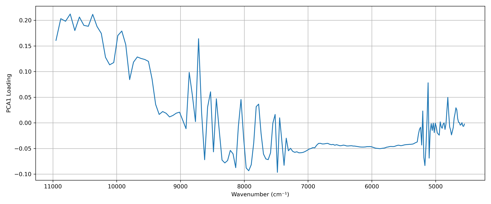
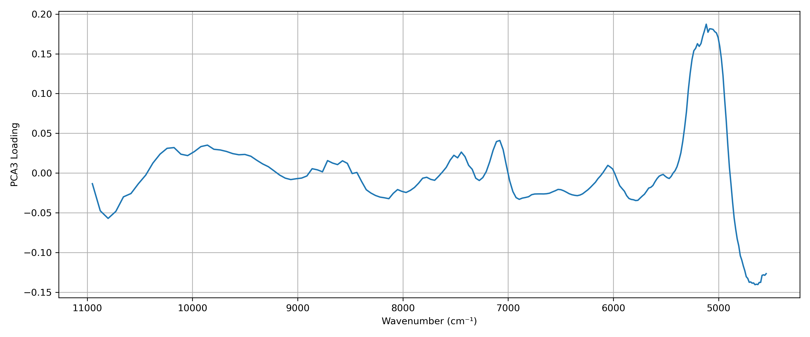
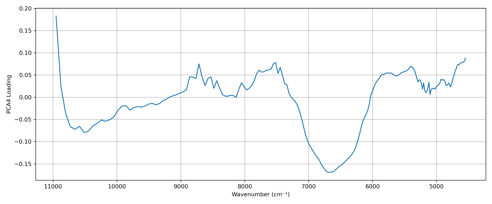

## ✅ データ前処理


1. **強度から反射率への変換**
   観測した強度データ $I(\lambda)$ を基準標準物質の強度 $I_{\text{ref}}(\lambda)$ で割ることで反射率 $R(\lambda)$ を算出しました：

$$
R = \frac{(I_{3.0} - D_{3.0}) / 3}{(W_{2.5} - D_{2.5}) / 2.5}
$$

2. **木材マスクの作成とスペクトル抽出**
   ハイパースペクトル画像から木材部分を抽出するためにマスク処理を行い、木材領域のスペクトルを取得しました。

3. **SNV処理（Standard Normal Variate）**
   各スペクトル $x$ に対して、平均値 $\bar{x}$ と不偏標準偏差 $s_x$ を用い、以下のように正規化しました：

$$
x_{\mathrm{SNV}} = \frac{x - \bar{x}}{s_x}
$$

---

## 🔍 主成分分析 （PCA）

累積寄与率90%以上となる最小の $k$ を選択

```python
from sklearn.preprocessing import MinMaxScaler
from sklearn.decomposition import PCA
mm = MinMaxScaler()
pca = PCA()

pca.fit(hinoki_snv)
cvr = np.cumsum(pca.explained_variance_ratio_)
k = np.argmax(cvr >= 0.90) + 1
```
<br>

80%以上の累積寄与率を達成する最小次元数: $k=11$

```python
n_dim = 5
pca = PCA(n_components=n_dim)

hinoki_pca = pca.fit_transform(hinoki_snv)
hinoki_pca_mm = mm.fit_transform(hinoki_pca)
```

要約された11個の変数に対して0~1に正規化し、以下のように可視化した。

<table>
  <tr>
    <th>PC1</th>
    <th>PC2</th>
    <th>PC3</th>
  </tr>
  <tr>
    <td></td>
    <td></td>
    <td></td>
  </tr>
  <tr>
    <th>PC4</th>
    <th>PC5</th>
  </tr>
  <tr>
    <td></td>
    <td></td>
  </tr>
</table>

### PCA Loading Plot

<table>
  <tr>
    <th>PC1 Loading</th>
    <th>PC2 Loading</th>
    <th>PC3 Loading</th>
  </tr>
  <tr>
    <td></td>
    <td></td>
    <td></td>
  </tr>
  <tr>
    <th>PC4 Loading</th>
    <th>PC5 Loading</th>
  </tr>
  <tr>
    <td></td>
    <td></td>
  </tr>
</table>

### ご指摘いただいた部分をやり直しました！何か変な点、間違った点があると指摘して欲しいです。
